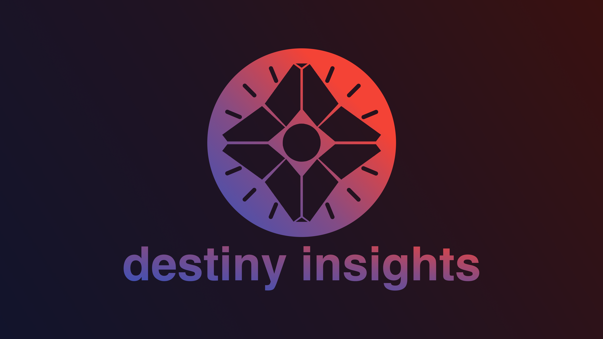

  
  
  
  

<h3 align="center"><b><a href="https://destinyinsights.com">https://destinyinsights.com</a></h3>

## What is it?

A simple way, on any device, to quickly see info about Destiny.

## Want to Contribute?

Rad, thanks! Check out the [contributing guide](./CONTRIBUTING.md).

## CHANGELOG

[destiny-insights-frontend changelog](./CHANGELOG.md)

Made with :heart:, JavaScript, and GitHub.
